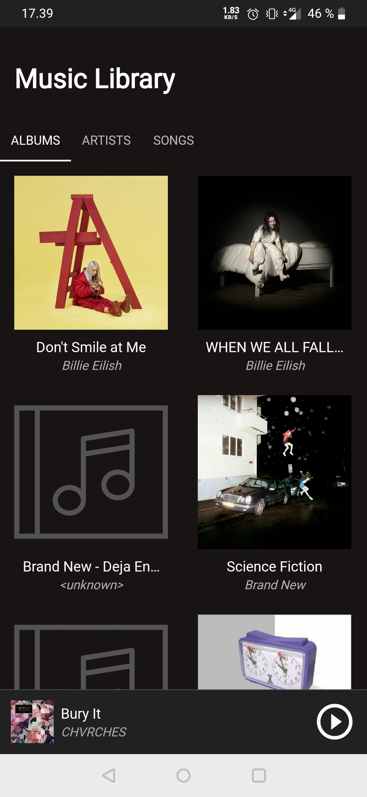
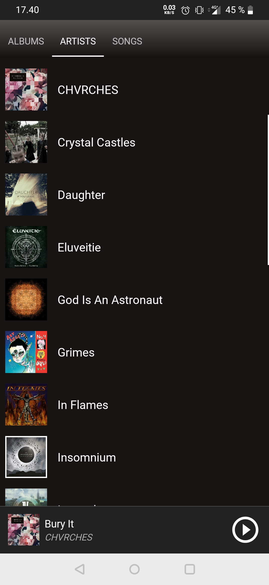
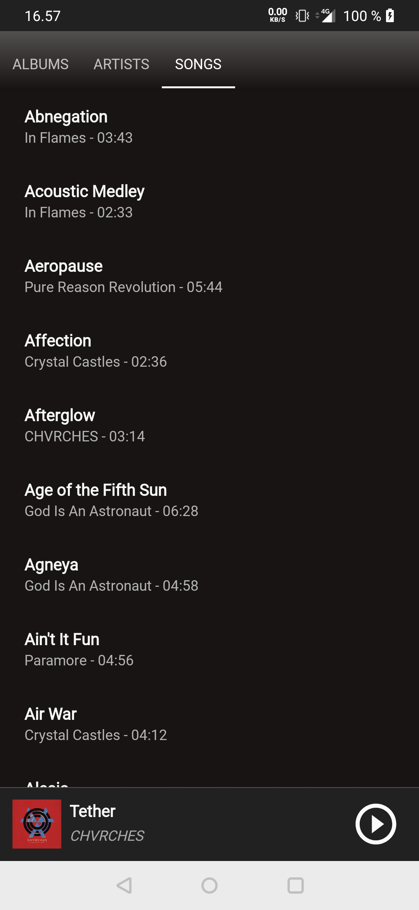
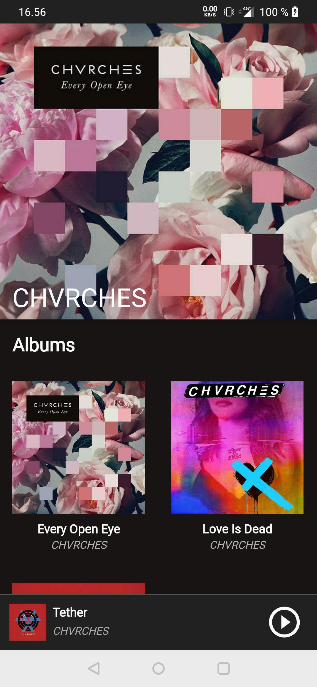
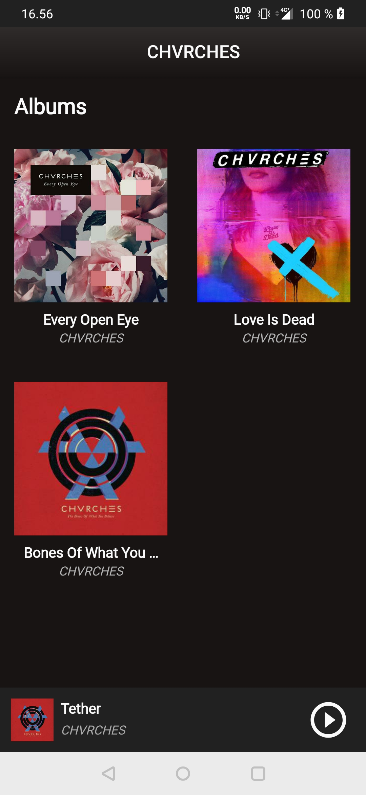
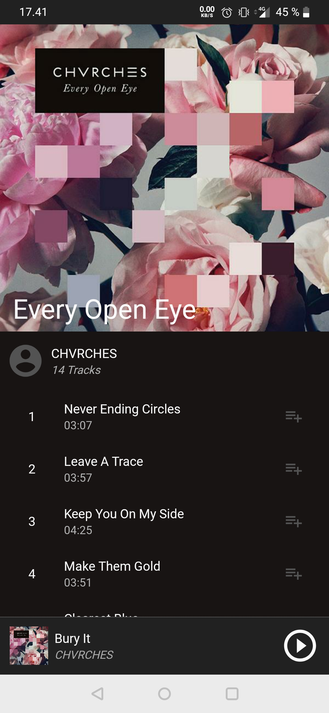
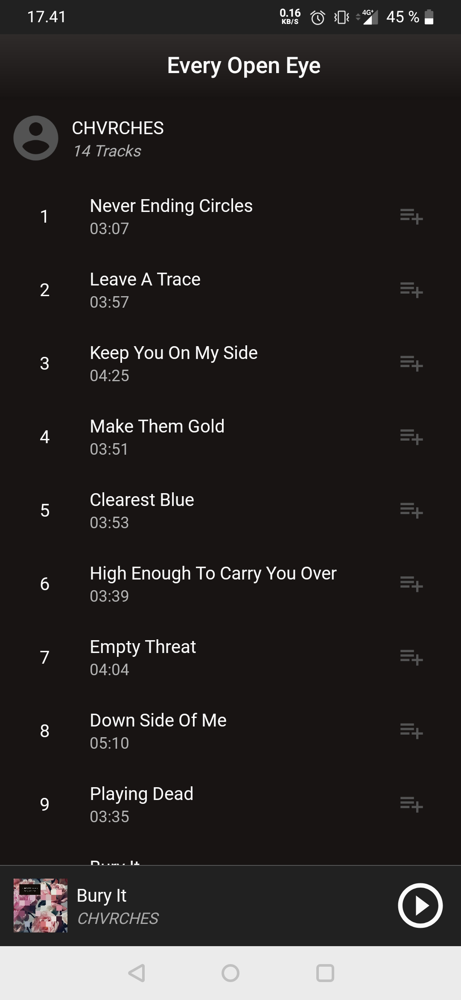
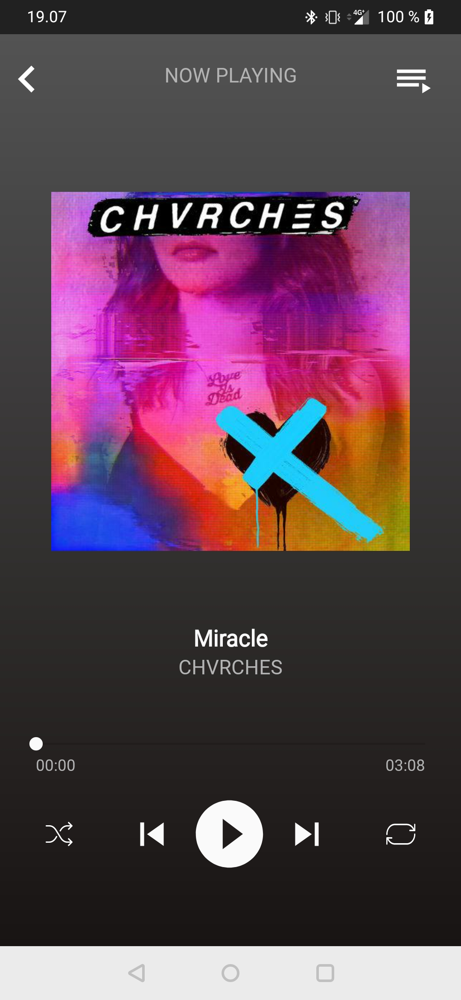
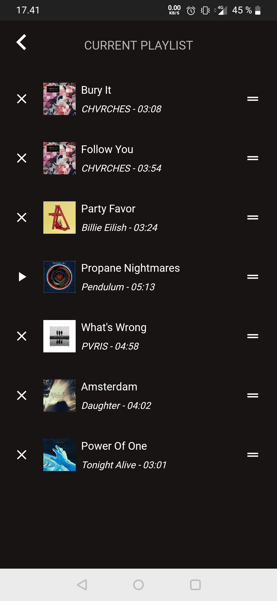

# Generic music player - Natiivi musiikkisoitin androidille

## Status

V. 0.3

### Implementoidut ominaisuudet

- Musiikkitiedostojen hakeminen ja listaus.
- Musiikin toistaminen mediaplayerin avulla.
- Toiston tilan tallennus kun sovellus suljetaan.
- Seekbar, suffle ja repeat soittimessa.
- UI:n päivitys mediatoiston tilan vaihtuessa.
- Soittolistan näyttäminen, hallinta, sekä kappaleiden lisääminen ja poistaminen.

### TODO

- Sovelluksen hallinta notificaatioalueen kautta

## Kehitysympäristö

* Android 10, api level 29
