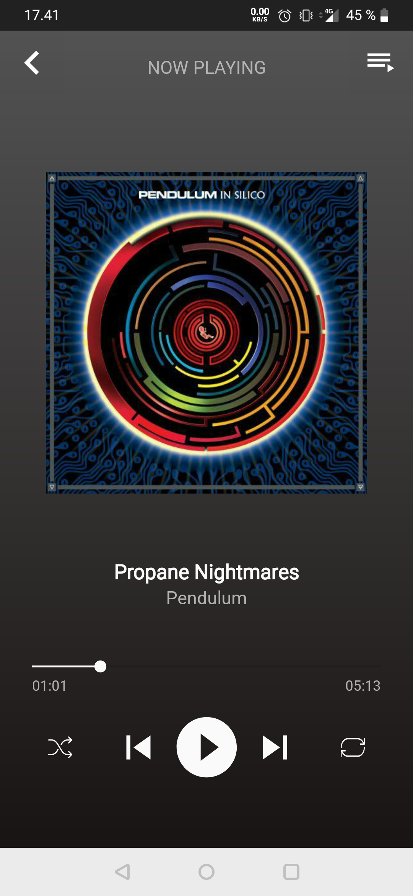

# Generic music player - Natiivi musiikkisoitin androidille

## Status

V. 0.2

### Implementoidut ominaisuudet

- Sovellus hakee musiikkitiedostot puhelimesta ja listaa ne
- Musiikin toistamisesta vastaava service
- Navigointi soittolistan kappaleiden välillä
- Soiton hallitseminen/playerin avaminen alanäkymän avulla
- Suljettaessa sovellus tallentaa viimeisimmän soittolistan sekä kappaleen ja avatessa palaa näihin

### TODO

- Toiston hallinta, seekbar/shuffle/repeat
- Soittolistan hallinta, kappaleiden lisääminen ja poistaminen
- Sovelluksen hallinta notificaatioalueen kautta

## Kehitysympäristö

* Android 10, api level 29

